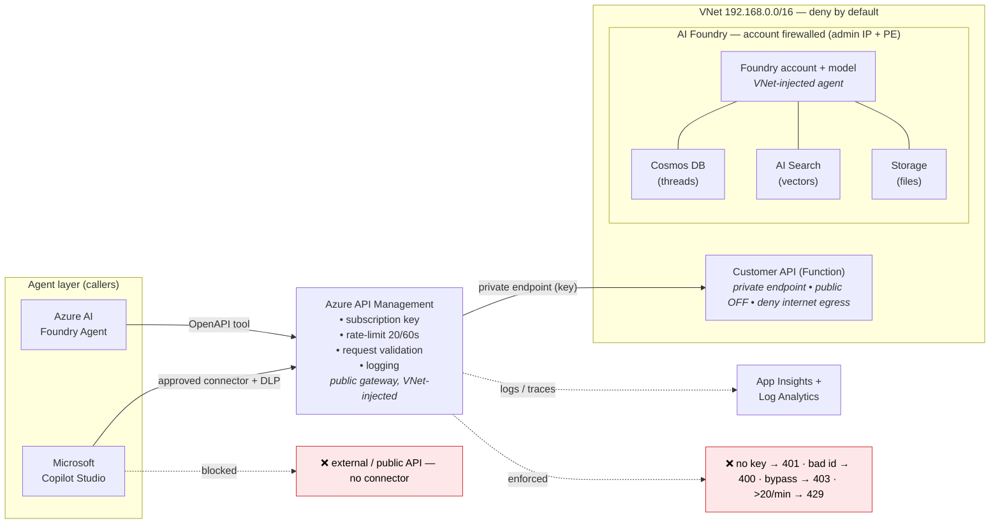

# Securing AI Agents the Zero-Trust Way

**One governed perimeter for Microsoft Copilot Studio _and_ Azure AI Foundry.**

A working, Terraform-deployed demo that proves enterprise-grade security for AI agents: VNet isolation, private endpoints, Azure API Management governance, and deny-by-default egress — with every control validated by a real HTTP status code, not a slide.

---

## Why this exists

Whether a team builds a low-code agent in **Copilot Studio** or a pro-code agent on **Azure AI Foundry**, the security team asks the same three questions:

1. **Where can the agent send data?** (egress / network control)
2. **What is it allowed to call, and can I see every call?** (API governance + audit)
3. **How do I know it can't wander off-script?** (agent-level restrictions)

This project answers all three with infrastructure you can deploy and test.

## Architecture

> **Agent → approved connector/tool → Azure API Management → private network (VNet + private endpoints) → private backend API.**



## How it's built (phased Terraform)

Each phase is independent infrastructure-as-code, validated before the next is layered on top.

| Phase | Folder | What it creates | Why |
|---|---|---|---|
| **1 · Foundation** | [`infra/terraform/01-foundation`](infra/terraform/01-foundation) | VNet, 4 subnets, NSGs (incl. deny-internet egress), 7 private DNS zones | The network perimeter — "where data can go" |
| **2 · Observability** | [`infra/terraform/02-observability`](infra/terraform/02-observability) | Log Analytics + Application Insights | Prove every control with telemetry |
| **3 · Backend** | [`infra/terraform/03-backend`](infra/terraform/03-backend) | Private Function API + storage (managed identity, public access OFF) | The data worth protecting |
| **4 · API Management** | [`infra/terraform/04-apim`](infra/terraform/04-apim) | VNet-injected APIM gateway + policies | The single governed door — auth, validation, rate-limit, logging |
| **5 · Foundry** | [`infra/terraform/05-foundry`](infra/terraform/05-foundry) | Foundry account/project/model + private Cosmos/Search/Storage | Network-isolated agent, same perimeter |

## Proof, not promises

Same results on **both** agent platforms:

| Scenario | Result | Proves |
|---|---|---|
| ✅ Approved API via gateway (with key) | **200** + data | The intended path works |
| ❌ Missing / invalid key | **401** | Auth enforced at the gateway |
| ❌ Invalid / injection-style id | **400** | Input validated before backend |
| ❌ Undefined route / other API | **404** | No connector exists for anything else |
| ❌ Direct-to-backend (bypass) | **403** | Backend is private-only |
| ❌ Abusive burst | **429** | Rate limiting protects the backend |

## Repository map

| Path | Contents |
|---|---|
| [`infra/terraform/`](infra/terraform) | The five deployment phases |
| [`src/customer-api/`](src/customer-api) | Mock customer/risk API (Azure Functions) |
| [`docs/article.md`](docs/article.md) | Full step-by-step write-up (what / why / how it helps) |
| [`docs/phase-1-foundation.md`](docs/phase-1-foundation.md) | Phase 1 diagram with NSG rules |
| [`docs/architecture.html`](docs/architecture.html) | Interactive architecture + real-world walkthrough |
| [`docs/build-journal.md`](docs/build-journal.md) | Decision log and gotchas |
| [`docs/agent-setup-guide.md`](docs/agent-setup-guide.md) | Wiring the Foundry agent + Copilot Studio connector |

## Deploy

Each phase is applied in order (Windows PowerShell):

```powershell
terraform -chdir="infra/terraform/01-foundation" init
terraform -chdir="infra/terraform/01-foundation" apply -input=false
# …repeat for 02 → 05
```

> Provide secrets (subscription ID, allow-listed IP, etc.) via each phase's `terraform.tfvars` — **not committed** (see [.gitignore](.gitignore)).

## The honest caveat

Copilot Studio is SaaS — you **cannot** force its own outbound traffic through your VNet. So its hop is governed by an **allow-listed custom connector + Power Platform DLP + gateway key**; VNet/private-endpoint egress control applies from **API Management inward**, where the sensitive data lives.

---

*This is a demo pattern for learning and customer conversations — not production hardening. See [`docs/build-journal.md`](docs/build-journal.md) for the full reasoning and known gotchas.*
