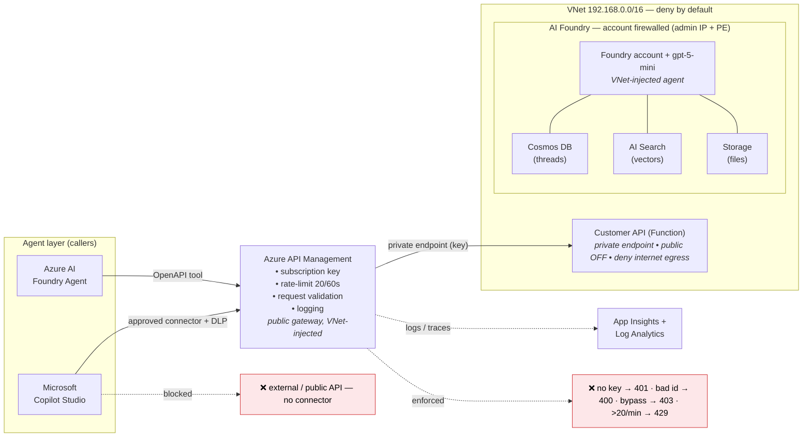

# Architecture — Secure AI Agents on Azure

Two views of the same design:
- **Deck / whiteboard:** [architecture.excalidraw](architecture.excalidraw) — open at https://aka.ms/excalidraw
- **In-repo (below):** Mermaid

## Zero-Trust egress flow

## Reading it
- **Left → center:** both agents can only reach **APIM** (Copilot Studio via an allow-listed connector + DLP; Foundry via an OpenAPI tool). Copilot Studio is SaaS, so its hop is governed by connector + DLP + key — not the VNet.
- **Center → right:** APIM is the single governed door; it calls the **private** Function backend via a private endpoint using the key. Everything past APIM is inside the VNet with **no public access** and **deny-internet egress**.
- **Foundry stack:** the agent's state (threads, vectors, files) stays in **customer-owned, private** Cosmos / AI Search / Storage; the Foundry account is firewalled to the admin IP + private endpoint.
- **Blocked (red):** external APIs (no connector), missing/invalid key (401), invalid id (400 at the gateway), direct-to-backend bypass (403, private-only), and rate abuse (429).

See [build-journal.md](build-journal.md) for the full decision log and [agent-setup-guide.md](agent-setup-guide.md) for wiring the agents.
