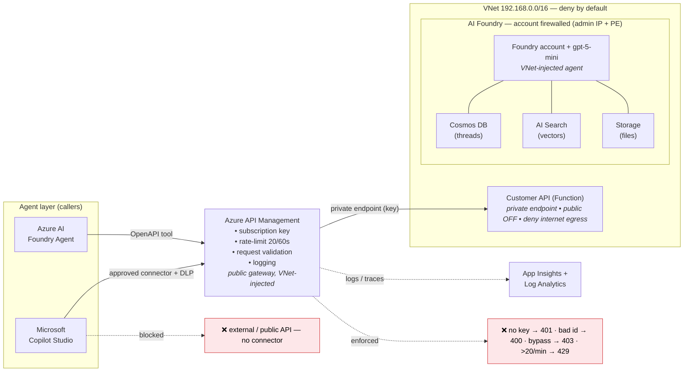

# Securing AI Agents the Zero-Trust Way

### One governed perimeter for Microsoft Copilot Studio *and* Azure AI Foundry

> A step-by-step account of a demo environment built to prove enterprise-grade security for AI agents — **what** each piece is, **why** it exists, and **how** it helps the customer. Everything below is deployed with Terraform and validated end-to-end, so every claim can be tested rather than promised.

---

## Contents

- [Why this exists](#why-this-exists)
- [The architecture in one sentence](#the-architecture-in-one-sentence)
- [Architecture diagram](#architecture-diagram)
- [How it's built, step by step](#how-its-built-step-by-step)
  - [Step 1 — The network boundary](#step-1--the-network-boundary)
  - [Step 2 — Observability first](#step-2--observability-first)
  - [Step 3 — The private backend API](#step-3--the-private-backend-api)
  - [Step 4 — API Management, the governance chokepoint](#step-4--api-management-the-governance-chokepoint)
  - [Step 5 — Azure AI Foundry inside the same perimeter](#step-5--azure-ai-foundry-inside-the-same-perimeter)
- [The honest caveat: Copilot Studio is SaaS](#the-honest-caveat-copilot-studio-is-saas)
- [Proof, not promises](#proof-not-promises)
- [Lessons from the build](#lessons-from-the-build)
- [Takeaways for customers](#takeaways-for-customers)
- [Repository map](#repository-map)

---

## Why this exists

Every enterprise is racing to put AI agents in front of employees and customers. Some build low-code agents in **Microsoft Copilot Studio**; others build pro-code agents on **Azure AI Foundry**. Different teams, different tools — but the moment the security team gets involved, the conversation is *identical* and comes down to three questions:

1. **Where can this agent send data?** An agent that can call "any URL" is a data-exfiltration channel with a friendly chat window on top.
2. **What is the agent actually allowed to call, and can I see every call?** "Trust me, it only reads the customer record" is not an audit answer.
3. **How do I know it can't wander off-script?** Prompt injection, a rogue tool, a curious user — the blast radius must be bounded by design, not by hope.

Slides don't answer those questions. This project is a **working demo you can test**: you can watch the allowed call succeed and, just as importantly, watch every disallowed call get blocked with a real HTTP status code.

The core idea: **put both agent platforms behind the exact same Zero-Trust perimeter.** The security story a customer must approve is then the same whether their team ships on Copilot Studio or on Foundry. One perimeter to review, one perimeter to defend.

---

## The architecture in one sentence

> **Agent → an approved connector/tool → Azure API Management → a private network (VNet + private endpoints) → a private backend API.**

Everything to the right of API Management lives inside a virtual network with **no public access** and **deny-by-default internet egress**. API Management is the single, governed front door. The agent's *only* external capability is one approved API — it literally has no way to express a call to anything else.

To make it concrete, picture a **bank's support copilot** that looks up a business customer's risk score before a loan officer approves a wire transfer. That copilot *must* read the core risk system — but it must reach **only** that one approved API. Never the open internet. Never a public data broker. Never the database directly. That is the scenario this environment enforces.

---

## Architecture diagram

*An interactive version with real-world walkthrough scenarios is in [architecture.html](architecture.html); a whiteboard version is in [architecture.excalidraw](architecture.excalidraw).*

---

## How it's built, step by step

The environment is deployed in **phases**, on purpose. Each phase is independent infrastructure-as-code (Terraform), and every layer is validated before the next one is built on top of it. That discipline matters: when something breaks you know exactly which layer to look at, and a customer can adopt the pattern one layer at a time instead of swallowing it whole.

### Step 1 — The network boundary

*The "where can data go?" answer.*

**What is built.** A virtual network with dedicated, purpose-built subnets — one each for API Management, the backend function, private endpoints, and the Foundry agent. Every subnet has a Network Security Group (NSG). The backend subnet carries an explicit **deny-all-internet-outbound** rule. On top of that, **private DNS zones** exist for every Azure dependency (storage, the function host, the AI services, Cosmos DB, AI Search) so every name resolves to a *private* IP inside the VNet, never a public one.

**Why it's built this way.** The network is the hardest, least-bypassable boundary available. Application-layer rules can be misconfigured; a deny rule on outbound traffic cannot be talked around by a clever prompt. Private DNS is the quiet hero — without it, a resource might resolve to its public endpoint and "leak" around the private path. With it, the private path is the *only* path.

**How it helps the customer.** This is the literal answer to "where can the agent send data?" — **nowhere you didn't approve.** A security reviewer can read the NSG rules and the DNS zones and *see* the boundary rather than take anyone's word for it.

### Step 2 — Observability first

*So every later claim is provable.*

**What is built.** A Log Analytics workspace and an Application Insights instance, wired in before any workload exists.

**Why it's built this way.** You can't prove a security control works if you can't see the traffic. Putting monitoring *first* means every subsequent layer emits telemetry from the moment it's born — no retrofitting, no blind spots during the interesting early failures.

**How it helps the customer.** Auditability. Every agent call, every allow, every block lands in a queryable log. "Show me every call this agent made last Tuesday" becomes a query, not a shrug.

### Step 3 — The private backend API

*The thing worth protecting.*

**What is built.** A serverless function that returns the business data the agent needs — here, a mock customer record with a risk score and recent transactions. Its **public network access is turned off**; it is reachable only through a **private endpoint** from inside the VNet. It authenticates to its own storage with a **managed identity** — no connection strings, no keys in config.

**Why it's built this way.** This is the crown jewel — the sensitive data the whole perimeter exists to protect. Disabling public access entirely removes the single most common mistake: an internet-reachable API "protected" only by a key. Even if an attacker learned the backend's exact hostname, hitting it from the public internet returns **403 Forbidden**. There's no front door on the street; the only door is inside the building.

**How it helps the customer.** Defense in depth. The data isn't safe *because* of one control — it's safe because it's off the internet, behind a private endpoint, and only reachable through a governed gateway. Remove any one control and the others still hold.

### Step 4 — API Management, the governance chokepoint

*The "what can it call, and can I see it?" answer.*

**What is built.** An API Management instance injected into the VNet — public gateway on the front, private backend on the back. Exactly one API is published through it (the customer-lookup call), with policies every request must pass:

- **Authentication** — a subscription key (OAuth in production) enforced at the gateway.
- **Rate limiting** — an abusive burst of calls is throttled.
- **Request validation** — a malformed or injection-style id (e.g. `'; DROP` tricks) is rejected *at the gateway* and **never reaches the backend**.
- **Logging** — every call is recorded to Application Insights.

**Why it's built this way.** A perimeter needs a single, well-lit chokepoint where policy is enforced and everything is observed. Scattering auth and validation across many services means many places to get it wrong. One gateway means one place to enforce, one place to audit, and one place to change the rules for everyone at once.

**How it helps the customer.** This is the answer to "what is the agent allowed to do?" — precisely one operation, with auth, throttling, input validation, and a complete audit trail. If the agent tries anything else, there's simply no route for it.

### Step 5 — Azure AI Foundry inside the same perimeter

*Agent-level isolation.*

**What is built.** A Foundry account and project deployed **VNet-injected**, with a language model deployed for the agent to reason with. Critically, *all of the agent's state* lives in **customer-owned, private** resources: conversation threads in **Cosmos DB**, vector data in **AI Search**, files in **Storage** — each with local/key auth disabled, locked to **managed-identity RBAC**, and network access set to private (Cosmos and Search fully disabled from the public internet; storage locked to an Azure-services-only bypass). The Foundry account itself is firewalled to a single allowed IP, and the agent's *one* external tool points at the **same API Management endpoint** as the Copilot Studio connector.

**Why it's built this way.** A Foundry agent's memory *is* sensitive data — the transcripts, the retrieved documents, the uploaded files. If that lived in a Microsoft-managed multi-tenant store, the customer would have to trust a boundary they can't see. Making all of it customer-owned and private means the data never leaves the tenant, there are no shared secrets to leak, and access is governed by identity rather than by a key someone might paste into a chat message.

**How it helps the customer.** The pro-code agent platform inherits the *exact same* guarantees as the low-code one. A customer doesn't run two different security reviews for two different agent stacks — the perimeter, the egress control, and the audit story are identical.

---

## The honest caveat: Copilot Studio is SaaS

Say this plainly, because glossing over it is how you lose a security audience: **you cannot force Copilot Studio's own outbound traffic through your VNet.** It's a software-as-a-service platform. Being clear about that boundary is what makes the rest of the story credible.

So for the Copilot Studio hop, governance is applied where you *can* apply it:

- a **custom connector locked to the API Management host** — no generic "call any HTTP endpoint" action is allowed,
- a Power Platform **Data Loss Prevention (DLP) policy** that allow-lists *only* that connector and blocks everything else,
- and the **subscription key** enforced at the gateway.

VNet and private-endpoint egress control then applies from **API Management inward** — exactly where the sensitive data lives. The agent can only speak to your gateway, and your gateway is the mouth of a private, deny-by-default network. That's the honest, defensible line: SaaS-appropriate controls on the SaaS hop, hard network isolation everywhere the data actually sits.

---

## Proof, not promises

A security demo is only worth something if it can *show the blocks*, not just the happy path. Every scenario is validated end-to-end, with the **same results on both agent platforms**:

| Scenario | Result | What it proves |
|---|---|---|
| ✅ Agent calls the approved API through the gateway (with key) | **200** + data | The intended path works |
| ❌ Missing or invalid key | **401 Unauthorized** | Auth is enforced at the gateway |
| ❌ Invalid / injection-style id | **400 Bad Request** | Input is validated before the backend |
| ❌ Undefined route / a different external API | **404 Not Found** | No connector exists for anything else |
| ❌ Direct call to the backend, bypassing the gateway | **403 Forbidden** | The backend is private-only |
| ❌ Abusive burst of calls | **429 Too Many Requests** | Rate limiting protects the backend |

One perimeter, two agent stacks, identical guarantees — and every guarantee is demonstrated with a real status code, not asserted on a slide.

---

## Lessons from the build

- **Landing-zone guardrails will surprise you.** Deploying into a governed platform subscription meant org policies *mutated resources after creation* — a DDoS plan auto-attached and blocked VNet creation; IP tags got stamped onto a public IP and forced a replacement. The lesson: *expect* that drift. Scope policy exemptions narrowly and tell your infrastructure code to ignore the specific fields the platform manages.
- **Serverless + private networking has sharp edges.** Once public access is off, some deployment and key-management paths behave differently. The most robust pattern: keep the backend **anonymous but network-isolated**, and enforce *all* client authentication at the gateway. No shared secret to leak, and the network is the hard boundary.
- **Model availability moves under you.** "Deploy this specific model version" quietly stopped working for *new* deployments as the model aged out. Always query the currently available models for your region instead of hard-coding a version.
- **Write the "why" down as you go.** A running decision log — every choice, every gotcha, every validation result — doubled as the customer-facing narrative when it came time to explain the environment. The reasoning is worth more than the resource list.

---

## Takeaways for customers

If your security team is nervous about AI agents, you do **not** have to choose between "ship fast" and "stay safe." The pattern here is deliberately boring, proven enterprise plumbing applied to a new kind of workload:

- **VNet + private endpoints** control *where data can go* — deny by default.
- **API Management** controls *what the agent can do* — one governed operation, fully audited.
- **Connector allow-listing + DLP** (Copilot Studio) and **managed-identity RBAC** (Foundry) control *the agent itself* — no generic actions, no shared secrets.
- **Everything is provable** — every block returns a real status code you can demonstrate.

One governed perimeter. Two agent platforms. Zero uncontrolled egress. That's a security story a customer can actually approve — because they can test it themselves.

---

## Repository map

| Path | What's there |
|---|---|
| [`infra/terraform/01-foundation`](../infra/terraform/01-foundation) | VNet, subnets, NSGs, private DNS zones |
| [`infra/terraform/02-observability`](../infra/terraform/02-observability) | Log Analytics + Application Insights |
| [`infra/terraform/03-backend`](../infra/terraform/03-backend) | Private Function backend + storage (managed identity) |
| [`infra/terraform/04-apim`](../infra/terraform/04-apim) | API Management gateway + policies |
| [`infra/terraform/05-foundry`](../infra/terraform/05-foundry) | AI Foundry account, project, model, private data stores |
| [`src/customer-api`](../src/customer-api) | The mock customer/risk API (Azure Functions) |
| [`docs/architecture.html`](architecture.html) | Interactive architecture + real-world walkthrough |
| [`docs/build-journal.md`](build-journal.md) | Full decision log and gotchas |
| [`docs/agent-setup-guide.md`](agent-setup-guide.md) | Wiring the Foundry agent and Copilot Studio connector |

*Happy to walk any team through the architecture and the build notes — this is exactly the conversation more enterprises should be having before their agents go live.*
