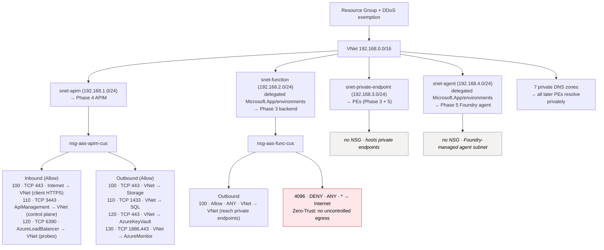

# Phase 1 — Foundation (network perimeter)

How Phase 1 sets up every later phase: the VNet, its four purpose-built subnets, their NSGs (inbound/outbound rules), the deny-by-default egress rule, and the private DNS zones.

Only `snet-apim` and `snet-function` have NSGs. `snet-private-endpoint` and `snet-agent` have **no NSG** (private endpoints don't need one; the agent subnet is delegated and managed by the Foundry platform).

## Subnet plan

| Subnet | CIDR | Role | Special config |
|---|---|---|---|
| `snet-apim` | `192.168.1.0/24` | API Management injection | No delegation (stv2 needs a plain subnet) |
| `snet-function` | `192.168.2.0/24` | Function VNet integration | Delegated to `Microsoft.App/environments` |
| `snet-private-endpoint` | `192.168.3.0/24` | Hosts private endpoints | Plain subnet |
| `snet-agent` | `192.168.4.0/24` | Foundry Standard Agent | Delegated to `Microsoft.App/environments` |

See [../infra/terraform/01-foundation/main.tf](../infra/terraform/01-foundation/main.tf) for the full definition and [build-journal.md](build-journal.md) for the decision log.
