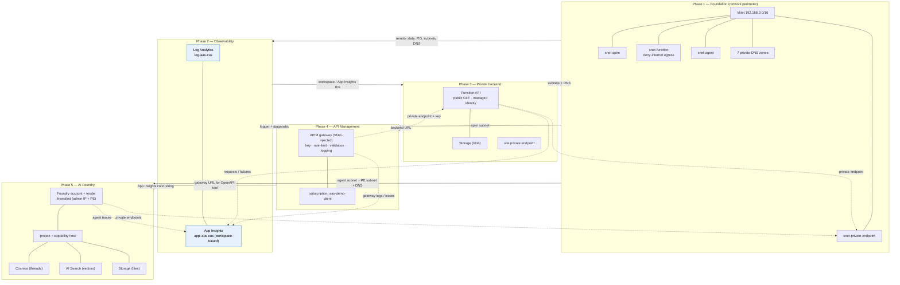

# The five phases, on one page

Each phase is independent Terraform with its own state. Later phases read earlier phases via `terraform_remote_state`, and at runtime traffic/telemetry flows between the deployed resources. Solid arrows = **build-time dependency** (remote state); dotted arrows = **runtime** data/telemetry flow.

## What each phase contributes

| Phase | Creates | Security question it answers |
|---|---|---|
| **1 · Foundation** | VNet, 4 subnets, NSGs (deny-internet egress), 7 private DNS zones | *Where can data go?* — nowhere unapproved |
| **2 · Observability** | Log Analytics + workspace-based App Insights | *Can I prove it?* — every hop is logged |
| **3 · Backend** | Private Function API + storage, public access OFF, managed identity | *What are we protecting?* — the data, off the internet |
| **4 · API Management** | VNet-injected gateway + policies (key, rate-limit, validation, logging) | *What can the agent call?* — one governed operation |
| **5 · AI Foundry** | Foundry account/project/model + private Cosmos/Search/Storage | *Same guarantees for pro-code agents* |

## Reading the arrows

- **Solid** (`—▶`): a phase consumes an earlier phase's outputs at deploy time via `terraform_remote_state` — e.g. Phase 4 needs Phase 1's `snet-apim` and Phase 3's backend URL.
- **Dotted** (`⋯▶`): live traffic or telemetry once deployed — e.g. APIM → Function over a private endpoint with the subscription key; all three tiers → App Insights.
- **Blue nodes**: the observability sink that every other phase reports into.

See each phase folder under [`../infra/terraform`](../infra/terraform) and the per-phase deep dives in [`../docs`](../docs).
